# Arduino_Raspberry_ROS_Car Tutorials

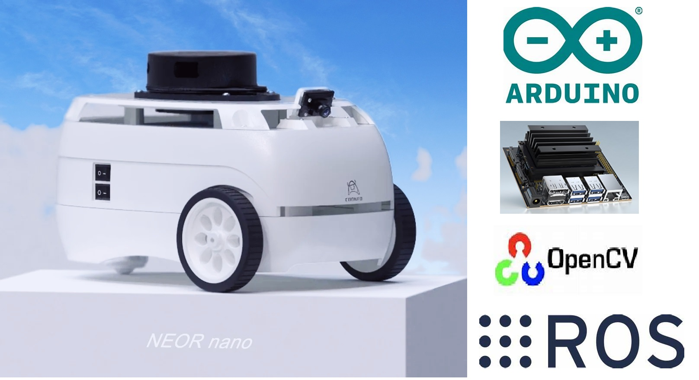


## chapter 1: Construction A ROS Car

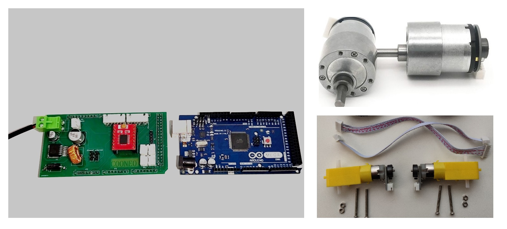

Download codes from Git:

```bash
git clone https://github.com/COONEO/Arduino_Jetson_nano_ROS_Car.git
```


### Step One: Download programs for Arduino Mega 2560

​	打开 你的 Arduino IDE，然后 进入 Arduino_code 文件夹找到 ROS小车电机驱动程序，可能需要安装附带的库；然后对照我们**微信公众号** ‘**COONEO** ’ 中的文章《开源！手把手教你驱动Arduino + ROS小车的电机》中的描述改动对应位置的程序，最后编译烧录进 Arduino mega 2560 中。

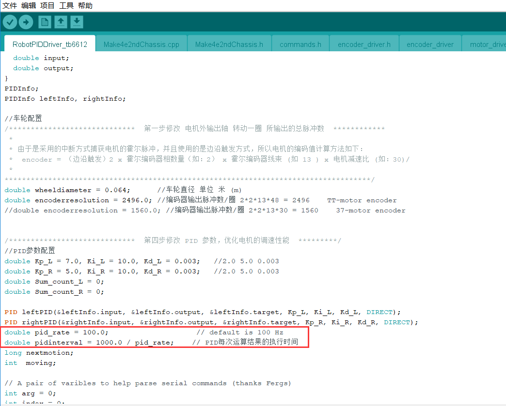

For more details,please see the Document in our Wechat ID COONEO :

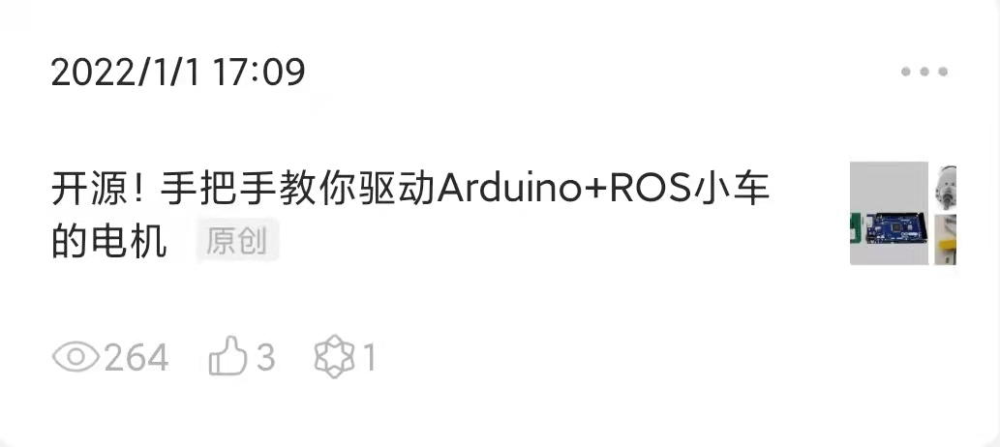

调节霍尔编码电机的速度PID参数方法，则参照微信公众号推文《开源！手把手教你如何调节Arduino编码电机速度PID》：

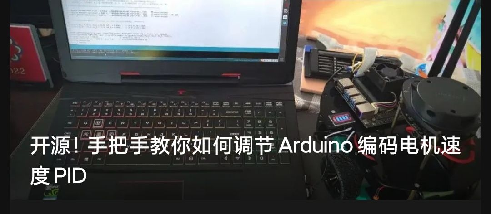


如果你使用的是Arduino 大功率电机及驱动器扩展板，那么烧录的程序就应该在该目录下：

```bash
Arduino_code/对应的Arduino程序/ROS小车电机驱动程序/Arduino_mega_2560大功率电机扩展板_code
```

具体的步骤，该文件夹中有图片提示。


### Step Two: FLASH OS and LAUNCH ROS NODE

1. 由于我们二次制作的Jetson-nano镜像（ 在英伟达官方的基础上 安装了ROS 环境 以及一些 常用软件 ）较大，您要是没有购买内存卡的又想节约时间的话，建议购买我们的内存卡服务哟，将为您安装好镜像；

2. 将 Jetson_nano_ROS_code 文件夹中的 工作空间移动至你新烧录的镜像中，需要自行检查的配置有两点：

   a. 配置 ros_arduino_bridge/ros_arduino_python 包中的配置文件（my_arduino_params.yaml），需要根据你使用的电机参数，轮胎左右安装的间距 更新对应的参数，配置文件中需要检查的地方均写了注释；

   b. 我们在镜像中 根据 lsusb 的信息绑定了 3个串口（A1M8雷达、IMU、Arduino），绑定之后，他们的访问

   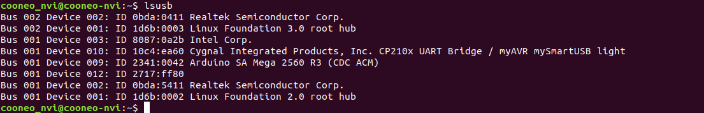

   名字分别变为了（LIDAR_PORT、IMU_PORT、Arduino_PORT）;该 rule 文件放置在了/etc/udev/rules.d/ 路径下，名为: cooneo_nvi_robot.rules 。如果你没有使用我们的硬件，但想使用我们的软件，请结合自己的 设备修改 rule 文件中的 两个 ID；

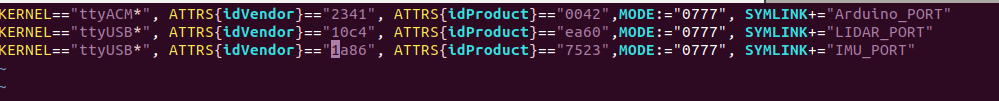


· 启动小车：

```bash
cd catkin_ws
catkin_make -j
source devel/setup.bash 
roslaunch ros_arduino_python arduino.launch
```

· 然后使用 rqt_robot_steering 尝试控制小车

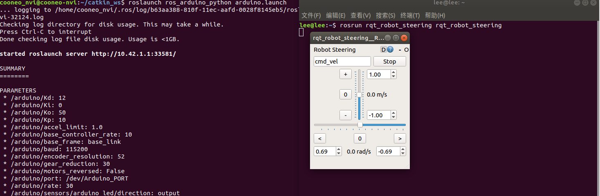


## chapter 2: Configure JY901 IMU

​	我们使用了一个带 温度和磁力计的 9轴 imu 模块儿，用来融合 轮式里程计 数据，然后实现 gmapping 建图。使用之前需要对该模块儿设置一番，对应的 ROS 包为 imu_901。其中的 resource_folder 文件夹中 有win10 下的配置软件，具体的设置方法，参考 imu_901/ReadMe.pdf 文件。

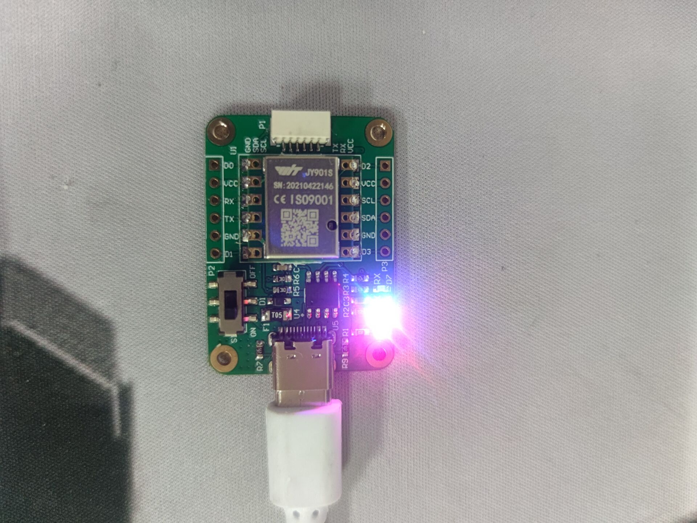

设置完毕后，将模块接入到 Jetson nano 的USB端口上即可（ps: 记得结合自己的安装位置修改imu_901.launch 中的 静态 tf 后面的参数）


## chapter 3: gmapping_ekf 	

​	如果您没有购买我们的整体小车，建议您自己按照我们的推文 配置 ROS 主从机，然后再参照我们的步骤运行 gmapping 建图演示:

```sh
# Jetson_nano 默认开启 热点模式
Wifi SSID name : cooneo_nvi
Wifi SSID password: cooneo_nvi

# 若使用热点模式 ssh 进 Jetson_nano
ssh cooneo_nvi@10.42.1.1
密码： cooneo_nvi
```

​	

**· **运行 建图 节点：

```bash
# 打开Jetson nano 中的终端 或者 ssh 进Jetson
cd catkin_ws
catkin_make -j
source devel/setup.bash 
roslaunch launch_file gmapping_ekf.launch 
```


**· 然后打开我们配套虚拟机中的程序：**

```bash
# 打开虚拟机中的一个终端 
cd catkin_ws
source devel/setup.bash 
roslaunch remote_gmapping joy_gmapping.launch
```

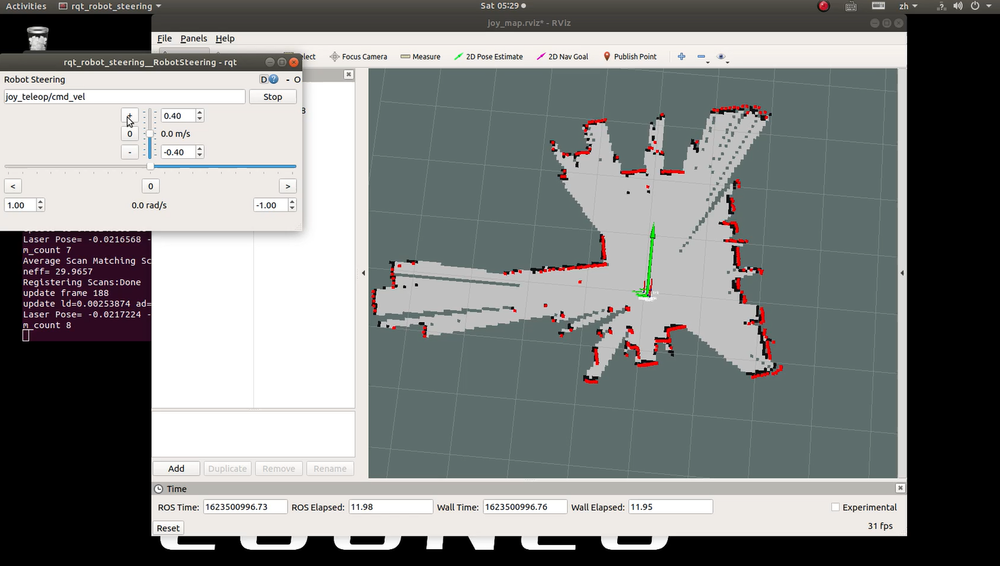


**· 保存地图**

```bash
# 打开Jetson nano 中的终端 或者 ssh 进Jetson
cd catkin_ws/src/launch_file/map/
rosrun map_server map_saver -f map

# 随后在该路径下会产生 两个文件 ，分别是 地图文件（map.pgm） 和 地图描述文件（map.yaml）
```


## chapter 4: navigation_ekf 

**· 运行导航节点**

```bash
# 打开Jetson nano 中的终端 或者 ssh 进Jetson
cd catkin_ws
source devel/setup.bash 
roslaunch launch_file navigation_ekf.launch
```


**· 打开虚拟机中配套的程序**

```bash
# 打开虚拟机中的一个终端
cd catkin_ws
source devel/setup.bash 
roslaunch remote_gmapping joy_navigation.launch
```

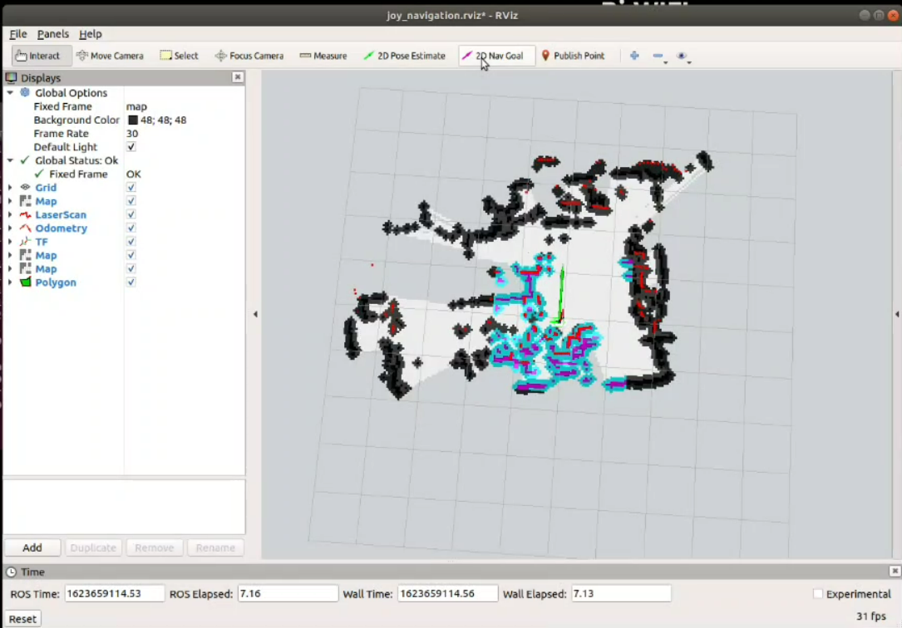


## chapter 5 : camera applications

**· 打开Jetson-nano 的CSI 摄像头**

```bash
cd catkin_ws
source devel/setup.bash 
roslaunch fire_detect Jetson_nano_csi_camera_node.launch
```


**· 打开火焰检测节点**

```bash
cd catkin_ws
source devel/setup.bash 
roslaunch fire_detect fire_detect.launch
```

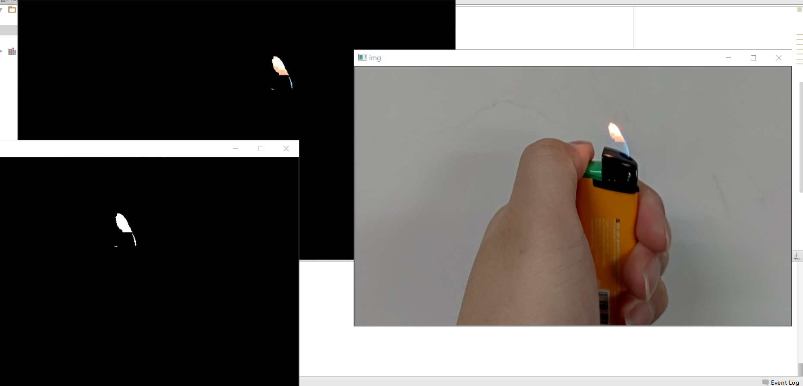

这里的火焰识别主要是基于颜色实现的 demo 级别功能，你可能需要根据你的 火苗大小动态修改代码中的值：

```python

        lower = [0, 43, 46]
        upper = [10, 255, 255]
        lower = np.array(lower, dtype="uint8")
        upper = np.array(upper, dtype="uint8")
        mask = cv2.inRange(hsv, lower, upper)
 
        output = cv2.bitwise_and(frame, hsv, mask=mask)
        no_red = cv2.countNonZero(mask)
        #修改这个判别值
        if int(no_red) > 40000:
            text = "Fire Detect"
            cv2.putText(frame, text, (100, 100), cv2.FONT_HERSHEY_COMPLEX, 2.0, (0, 0, 255), 5)
            # cv2.imshow("output", frame)
        else:
            cv2.putText(frame, "No Fire", (200, 100), cv2.FONT_HERSHEY_COMPLEX, 2.0, (0, 255, 0), 5)
            # cv2.imshow("output", frame)
        print(int(no_red))

```


**· 打开摄像头寻迹节点**

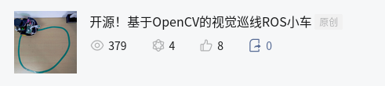

```
cd catkin_ws
source devel/setup.bash 
roslaunch linetrack linetrack_red.launch
```


这也是根据颜色来寻迹的，所以你需要根据你的巡线颜色修改 对应的HSV 颜色空间的范围。

```python

        '''
        # If your line color changes, it's not a red color,you need to change the HSV[min,max] value in np.array[ , , ]
        '''
        # 修改 对应的巡线颜色 HSV 范围
        lower_red = np.array([35,43,46])
        upper_red = np.array([77,255,255])
        #Threshold the HSV image to get only yellow colors
        mask = cv2.inRange(hsv,lower_red,upper_red)
        #cv2.imshow("MASK",mask)
        no_red = cv2.countNonZero(mask)
```


**温馨提示**：我们这个过程视频 也放在 COONEO Bilibili 账号中了，欢迎观看。

详细的过程解读，请参见我们的微信公众号: "COONEO"。


 2022.01.27

 author:ZhaoXiang Lee

COONEO Co.,Ltd

Web:[http://cooneo.cc](http://cooneo.cc/)

E: [cooneo@outlook.com](mailto:cooneo@outlook.com)

For more details,you can search "COONEO" in your WeChat.


or search "COONEO" in Bilibili.

